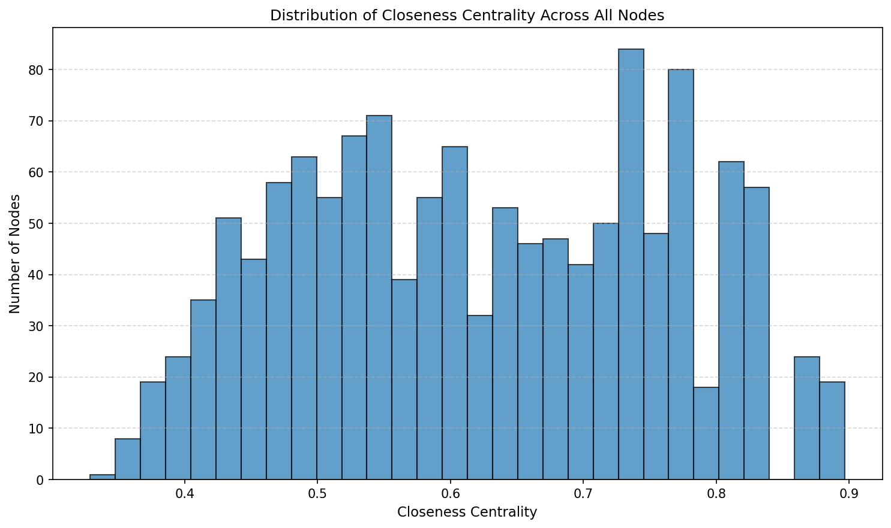
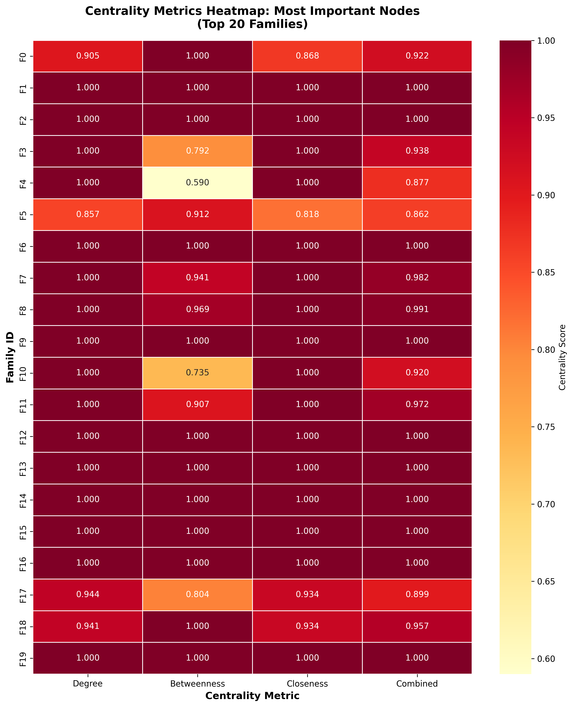

# MetaFam Knowledge Graph Analysis

A comprehensive analysis project that explores a family-based knowledge graph through graph analysis, community detection, rule mining, and knowledge graph embeddings.

---

## Table of Contents

1. [Project Overview](#project-overview)
2. [Directory Structure](#directory-structure)
3. [Dataset Description](#dataset-description)
4. [Installation & Setup](#installation--setup)
5. [Running the Project](#running-the-project)
6. [Tasks Overview](#tasks-overview)
7. [Approach & Methodology](#approach--methodology)
8. [Dependencies](#dependencies)
9. [Outputs & Visualizations](#outputs--visualizations)
10. [Key Findings](#key-findings)

---

## Project Overview

This project analyzes the **MetaFam Knowledge Graph**, a synthetic dataset representing family relationships. The analysis is divided into 4 main tasks:

- **Task 1**: Graph Analysis & Centrality Metrics
- **Task 2**: Community Detection & Evaluation
- **Task 3**: Rule Mining for Logical Inference
- **Task 4**: Knowledge Graph Embeddings using ComplEx

The knowledge graph contains entities (people) and relations (family relationships like `motherOf`, `fatherOf`, `sisterOf`, `grandmotherOf`, etc.) represented as triples in the format: `(head, relation, tail)`.

---

## Directory Structure

```
A-Study-on-MetaFam-Knowledge-Graph/
├── README.md                    # This file
├── MetaFam_study.pdf 
├── report.tex                   # LaTeX source for the report
├── requirements.txt             # Python environment dependencies
├── docs/
│   └── THEORY.md               # Detailed mathematical & theoretical foundations
├── data/
│   ├── train.txt               # Training triples (13,822 triples)
│   └── test.txt                # Test triples for evaluation
├── scripts/
│   ├── task-1.ipynb            # Graph Analysis & Centrality
│   ├── task-2.ipynb            # Community Detection
│   ├── task-3.ipynb            # Rule Mining
│   └── task-4.ipynb            # Knowledge Graph Embeddings
├── outputs/
│   ├── all_50_families.png
│   ├── closeness_centrality.png
│   ├── detailed_family_subgraph.png
│   ├── important_nodes_centrality_heatmap.png
│   ├── important_nodes_top5_families.png
│   ├── important_nodes_visualization.png
│   └── path_lengths_analysis.png
└── venv/                        # Python virtual environment
```

---

## Dataset Description

The dataset is a **family knowledge graph** with:

| Metric | Value |
|--------|-------|
| Total Triples (train) | 13,822 |
| Unique Entities | ~1,316 |
| Unique Relations | 26 |
| Number of Families | 50 |

### Sample Triples:
```
olivia0 sisterOf selina10
olivia0 daughterOf katharina1
olivia0 granddaughterOf ella19
olivia0 motherOf lisa5
```

### Relation Types:
- **Parent-Child**: `motherOf`, `fatherOf`, `daughterOf`, `sonOf`
- **Grandparent**: `grandmotherOf`, `grandfatherOf`, `granddaughterOf`, `grandsonOf`
- **Great-Grandparent**: `greatGrandmotherOf`, `greatGrandfatherOf`, etc.
- **Sibling**: `sisterOf`, `brotherOf`
- **Extended Family**: `auntOf`, `uncleOf`, `nieceOf`, `nephewOf`, `cousinOf`

---

## Installation & Setup

### Prerequisites
- Python 3.8+
- pip (Python package manager)

### Setup Instructions

1. **Clone the repository**:
   ```bash
   git clone https://github.com/phanindragollapalli/A-Study-on-MetaFam-Knowledge-Graph.git
   cd A-Study-on-MetaFam-Knowledge-Graph
   ```

2. **Create a virtual environment** (recommended):
   ```bash
   python -m venv venv
   source venv/bin/activate  # On Linux/Mac
   # or
   .\venv\Scripts\activate   # On Windows
   ```

3. **Install dependencies**:
   ```bash
   pip install numpy pandas matplotlib seaborn networkx scikit-learn torch community
   ```
   
   Or using requirements:
   ```bash
   pip install -r requirements.txt
   ```

---

## Running the Project

### Quick Start (Jupyter Notebook)

1. Start Jupyter:
   ```bash
   jupyter notebook
   ```
2. Navigate to the `scripts/` folder.
3. Open and run the notebooks in sequential order:
   - `task-1.ipynb` → Graph Analysis
   - `task-2.ipynb` → Community Detection
   - `task-3.ipynb` → Rule Mining
   - `task-4.ipynb` → Knowledge Graph Embeddings

### Troubleshooting & Detailed Execution Guide

> [!WARNING]
> Ensure your virtual environment is activated before launching Jupyter, otherwise the kernel might not find the installed dependencies.

- **Missing Modules**: If you get a `ModuleNotFoundError` for `community`, ensure you have installed `python-louvain` and *not* the package named `community`. Run `pip install python-louvain`.
- **PyTorch Installation**: If you are not using a GPU, the standard PyTorch installation via pip works perfectly. If you require CUDA, please install the specific PyTorch version for your CUDA toolkit from the [official PyTorch website](https://pytorch.org/).
- **Jupyter Kernel**: If Jupyter cannot find your virtual environment packages, you may need to register the kernel:
  ```bash
  python -m ipykernel install --user --name=venv --display-name "Python (venv)"
  ```
- **VS Code Users**: When opening the `.ipynb` files, ensure you select the correct Python interpreter (the one in your `venv`) in the top right corner of the notebook interface.

---

## Tasks Overview

### Task 1: Graph Analysis & Centrality Metrics
**File**: `scripts/task-1.ipynb`

Comprehensive analysis of the knowledge graph structure:
- Graph construction using NetworkX (MultiDiGraph)
- Node/edge statistics and degree distributions
- Centrality measures: Degree, Betweenness, Closeness centrality
- Family-level analysis (50 families detected)
- Path length analysis and eccentricity
- Clustering coefficients and graph density
- Identification of important nodes (bridge nodes, patriarchs/matriarchs)
- Shannon entropy analysis for relation diversity

### Task 2: Community Detection & Evaluation
**File**: `scripts/task-2.ipynb`

Detection and evaluation of communities in the family network:
- **Algorithms Used**:
  - Louvain Method (modularity optimization)
  - Girvan-Newman (edge betweenness)
- **Evaluation Metrics**:
  - Modularity score
  - Conductance
  - Internal Density
  - Purity Score
  - Normalized Mutual Information (NMI)
  - Adjusted Rand Index (ARI)
- Generation analysis (tracking genealogical depth)
- Cross-community and cross-family bridge analysis
- Community-aware relatedness scoring

### Task 3: Rule Mining for Logical Inference
**File**: `scripts/task-3.ipynb`

Discovery of logical rules from the knowledge graph:
- Implementation of **RuleMiner** class
- Horn clause mining (2-hop and 3-hop patterns)
- Inverse rule discovery
- **7 Rules Discovered** with support and confidence metrics:

| Rule | Type | Confidence |
|------|------|------------|
| motherOf(X,Y) ∧ motherOf(Y,Z) → grandmotherOf(X,Z) | Horn (2-hop) | 100% |
| fatherOf(X,Y) ∧ fatherOf(Y,Z) → grandfatherOf(X,Z) | Horn (2-hop) | 100% |
| motherOf(X,Y) ∧ fatherOf(Y,Z) → grandmotherOf(X,Z) | Horn (2-hop) | 100% |
| motherOf(X,Y) → daughterOf(Y,X) ∨ sonOf(Y,X) | Inverse | 60.57% |
| sisterOf(X,Y) → sisterOf(Y,X) ∨ brotherOf(Y,X) | Inverse | 100% |
| motherOf(X,Y) ∧ motherOf(Y,Z) ∧ motherOf(Z,W) → greatGrandmotherOf(X,W) | Horn (3-hop) | 100% |
| fatherOf(X,Y) ∧ motherOf(Y,Z) → grandfatherOf(X,Z) | Horn (2-hop) | 100% |

### Task 4: Knowledge Graph Embeddings
**File**: `scripts/task-4.ipynb`

Implementation of the **ComplEx** model for link prediction:
- Entity and relation embedding in complex vector space
- Scoring function using complex number multiplication
- Negative sampling for contrastive learning
- Training loop with Adam optimizer
- **Evaluation Metrics**:
  - Mean Reciprocal Rank (MRR)
  - Hits@1 (percentage ranked 1st)
  - Hits@10 (percentage in top 10)
- Link prediction demonstrations for various relation types

---

## Approach & Methodology

> [!NOTE]
> For a deep dive into the mathematical formulas, metrics definitions, and theoretical concepts used across these tasks, please refer to our comprehensive **[Theoretical & Mathematical Foundations](docs/THEORY.md)** guide.

### 1. Graph Construction
- Loaded triples from text files into a **NetworkX MultiDiGraph**
- Each triple `(head, relation, tail)` becomes a directed edge with relation as attribute
- Created undirected and weighted variants for different analyses

### 2. Family Identification
- Identified 50 distinct families using connected component analysis
- Each family forms a separate subgraph in the undirected representation

### 3. Centrality Analysis
- **Degree Centrality**: Measures node connectivity
- **Betweenness Centrality**: Identifies bridge nodes
- **Closeness Centrality**: Measures average distance to all other nodes
- Combined these to identify "most important" nodes in each family

### 4. Community Detection
- Used **Louvain** for fast, high-quality community detection
- Used **Girvan-Newman** for hierarchical community structure
- Compared communities with ground-truth families using clustering metrics

### 5. Rule Mining
- Built forward and reverse dictionaries for efficient pattern lookup
- Implemented mining functions for:
  - 2-hop Horn clauses: `rel1(X,Y) ∧ rel2(Y,Z) → rel3(X,Z)`
  - 3-hop Horn clauses: `rel1(X,Y) ∧ rel2(Y,Z) ∧ rel3(Z,W) → rel4(X,W)`
  - Inverse rules: `rel1(X,Y) → rel2(Y,X)`

### 6. Knowledge Graph Embeddings (ComplEx)
- Represented entities/relations as **complex vectors** (real + imaginary parts)
- Scoring function: `Re(⟨h, r, t̄⟩)` = `h_re·r_re·t_re + h_im·r_re·t_im + h_re·r_im·t_im - h_im·r_im·t_re`
- Training with **binary cross-entropy loss** on positive vs negative samples
- Complex embeddings handle **antisymmetric relations** better than real-valued approaches

---

## Dependencies

| Library | Version | Purpose |
|---------|---------|---------|
| `numpy` | >= 1.20 | Numerical operations |
| `pandas` | >= 1.3 | Data manipulation |
| `matplotlib` | >= 3.4 | Plotting and visualization |
| `seaborn` | >= 0.11 | Statistical visualizations |
| `networkx` | >= 2.6 | Graph construction and analysis |
| `scikit-learn` | >= 1.0 | Clustering metrics (NMI, ARI) |
| `torch` | >= 1.9 | Deep learning (ComplEx model) |
| `python-louvain` | >= 0.15 | Community detection (Louvain) |

### Install All Dependencies:
```bash
pip install numpy pandas matplotlib seaborn networkx scikit-learn torch python-louvain
```

---

## Outputs & Visualizations (Gallery)

Below are some of the key insights and visualizations generated by the analysis, available in the `outputs/` directory.

### 1. The MetaFam Network

*Overview of all 50 isolated family subgraphs identified via connected component analysis.*

### 2. Detailed Family Structure

*A close-up view of a single family's network topology and connections.*

### 3. Key Individuals

*Visualization highlighting the most central figures (patriarchs/matriarchs and major bridges).*

### 4. Centrality Analysis

*Distribution of closeness centrality across the network, showing how quickly information flows.*

### 5. Node Importance Heatmap

*Heatmap comparing degree, betweenness, and closeness centrality for key individuals.*

---

## Key Findings

1. **Graph Structure**:
   - 50 isolated families with no cross-family connections
   - Average family size: ~26 members
   - Rich relation diversity with 26 unique relation types

2. **Community Detection**:
   - Louvain achieves higher modularity (~0.87) than Girvan-Newman
   - High alignment with ground-truth families (Purity > 0.95)
   - Communities span 4-7 generations per family

3. **Rule Mining**:
   - 6 out of 7 discovered rules achieve 100% confidence
   - Lower confidence for inverse rules indicates incomplete data
   - Rules correctly capture multi-generational relationships

4. **Knowledge Graph Embeddings**:
   - ComplEx successfully learns family relationship patterns
   - Effective at predicting missing links for parent-child, grandparent-grandchild relations
   - Complex embeddings capture antisymmetric relation semantics


